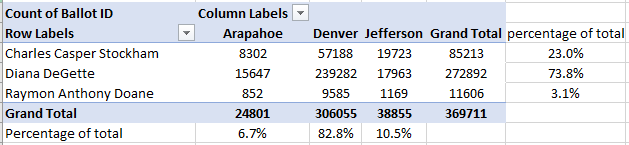

# Election_Analysis  

### Project summary  
    
The assignment is to use Python to automate the analysis and reporting of results for a subset of Colorado election resulst from Arapahoe, Denver, and Jefferson Counties.  
  
The required deliverables are:  
  
1. A python script that reads the .csv file containing the election results, tabulates the results for each candidate, determines the winner, and writes the results to a .csv file.
  
2. A .csv file, formatted as requested, containing the tabulated results of the election.  
  
### Data summary  
  
The data a stored in a .csv file with 3 columns (voter id, County, and Candidate selected) and 369,711 rows of data (each row is a vote).  
[raw data file](Resources/election_results.csv)  
  
A pivot table of the raw data (from Excel) can be used to QC the python analysis.  

  

### Methods  

1. The data file is opened using a with open as statement.  
2. The data file is read by the csv_reader() function as a list of lists.  
3. A for loop steps through each row in the list of lists.  
4. Total votes are accumulated and a list is populated with the candidate names using an if not in statement.  
5. The candidate names and accumulated votes per candidate are stored in a dictionary.  
6. The winning candidate is determined.  
7. The output file is opened with a with open as statement and the output is written to the file.  
  
  
