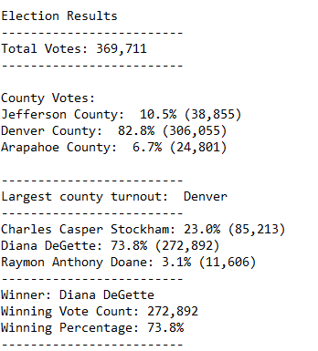

# Election_Analysis  

### Overview of election audit  
    
The election commission requested an audit of the voting results from three Colorado counties:  Arapahoe, Denver, and Jefferson.  The commission want to receive a text file containing:  
  
1. Tabulation of votes cast in each of the counties.  
2. Determination of the county with the greatest voter turnout.  
3. Tabulation of votes for each candidate.  
4. Determination of the winning candidate.  
  
The analysis must be automated by a python script.  The script must both print the results to the terminal and write the results to a text file.  
  
The required deliverables are:  
  
1. A python script that reads the .csv file containing the election results, tabulates the election results, prints the results to the terminal, and writes the results to a .csv file.
  
2. A .csv file, formatted as requested, containing the tabulated results of the election.  
  
### Data summary  
  
The data are stored in a .csv file with 3 columns (voter id, County, and Candidate selected) and 369,711 rows of data (each row is a vote).  
[raw data file](Resources/election_results.csv)  
  
A pivot table of the raw data (from Excel) can be used to QC the python analysis.  

  
  
### Election audit results  
  
- Total number of votes recorded: 369,711  
  
- County Votes:  
- Jefferson County:  10.5% (38,855)  
- Denver County:  82.8% (306,055)  
- Arapahoe County:  6.7% (24,801)  
  
- Largest county turnout:  Denver  
  
- Candidate votes:  
- Charles Casper Stockham: 23.0% (85,213)  
- Diana DeGette: 73.8% (272,892)  
- Raymon Anthony Doane: 3.1% (11,606)  
  
- Winner: Diana DeGette  
- Winning Vote Count: 272,892  
- Winning Percentage: 73.8%  
  
### Election audit summary  
  
The python script created to audit the election results for Arapahoe, Denver, and Jefferson counties accurately and quickly generates a report that summarizes the votes and winners.  
  
The script both prints the results to the terminal:  
  
  
and writes the results to a .csv file.    
  
  
However, the script is limited in application.  In particular, the script curretnly:  
- cannot not report out a tied election.  
- requires that the cvs format be exactly the same as the file used in this audit.  
- Cannot handle a csv file that contains elections for multiple positions in the same file.  
  
The script can be modified to provide quick and reliable election results for any election.  
  
To be applicable to all future elections the code should be modified to be more generalized.  It needs the following revisions:

1. Allow the user to determine which data are in which column.  The program will display the header and prompt the the user to enter the column number of the required data. The entered column identifications will be used in the subsequent analysis.  
2. Add logic that tests for a tied election and writes the data for a tied election to the terminal and a text file.  
3. If there is a column that identifies the position (in the case of multiple election results being reported in a singel csv file) then include logic that determines the election that a vote belongs to before collecting data per candidate and per county.  
  

If there is interest in having an automated procedure that can handle all future results then please let me know and I will deliver the general alogrithm described above.  
